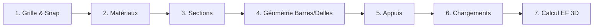

# Manuel d'Utilisation & Guide de Modélisation Structurale — StabileoViewer

Bienvenue dans le manuel d'utilisation complet de **StabileoViewer**, logiciel professionnel de CAO, de modélisation structurale et d'analyse par éléments finis (FEA) 3D développé en **C++20**, **OpenGL 3.3 Core**, **Dear ImGui (Docking)** et **.NET 6 CoreCLR (Scripting C#)**.

Ce guide détaillé vous explique pas-à-pas comment prendre en main le logiciel, dessiner une structure de A à Z (poteaux, poutres, dalles, appuis, charges), exploiter le solveur éléments finis, utiliser l'environnement Visual Studio 2026 en C# et automatiser vos calculs.

---

## Sommaire

1. [Architecture & Disposition de l'Interface](#1-architecture--disposition-de-linterface)
2. [Contrôles de la Caméra 3D & ViewCube](#2-contrôles-de-la-caméra-3d--viewcube)
3. [Guide Pas-à-Pas : Comment Dessiner une Structure](#3-guide-pas-à-pas--comment-dessiner-une-structure)
   - [Étape 1 : Préparer la grille et l'accrochage 3D (SnapEngine)](#étape-1--préparer-la-grille-et-laccrochage-3d-snapengine)
   - [Étape 2 : Définir les matériaux (Béton, Acier, Bois)](#étape-2--définir-les-matériaux-béton-acier-bois)
   - [Étape 3 : Configurer le catalogue des sections / profilés](#étape-3--configurer-le-catalogue-des-sections--profilés)
   - [Étape 4 : Dessiner les éléments structuraux](#étape-4--dessiner-les-éléments-structuraux)
     - [Méthode A : Dessin interactif à la souris (Poteau, Poutre, Dalle)](#méthode-a--dessin-interactif-à-la-souris-poteau-poutre-dalle)
     - [Méthode B : Saisie numérique directe de coordonnées](#méthode-b--saisie-numérique-directe-de-coordonnées)
     - [Méthode C : Générateur paramétrique instantané (Bâtiment R+2)](#méthode-c--générateur-paramétrique-instantané-bâtiment-r2)
   - [Étape 5 : Placer les appuis et conditions aux limites](#étape-5--placer-les-appuis-et-conditions-aux-limites)
   - [Étape 6 : Appliquer les charges et créer les combinaisons](#étape-6--appliquer-les-charges-et-créer-les-combinaisons)
4. [Calcul Éléments Finis 3D & Analyse des Résultats](#4-calcul-éléments-finis-3d--analyse-des-résultats)
   - [Lancement du calcul FEA (Direct Stiffness Method)](#lancement-du-calcul-fea-direct-stiffness-method)
   - [Visualisation de la déformée amplifiée](#visualisation-de-la-déformée-amplifiée)
   - [Diagrammes des efforts internes (N, Vy, Vz, My, Mz, T)](#diagrammes-des-efforts-internes-n-vy-vz-my-mz-t)
   - [Cartographie des contraintes et vérification réglementaire](#cartographie-des-contraintes-et-vérification-réglementaire)
   - [Tables de résultats et contrôle d'équilibre statique](#tables-de-résultats-et-contrôle-déquilibre-statique)
5. [Atelier de Scripting C# & Plugins (.NET CoreCLR / Roslyn)](#5-atelier-de-scripting-c--plugins-net-coreclr--roslyn)
   - [Réplique Haute-Fidélité de Visual Studio 2026 IDE](#réplique-haute-fidélité-de-visual-studio-2026-ide)
   - [Vérification réglementaire Eurocode 3 (NF EN 1993-1-1)](#vérification-réglementaire-eurocode-3-nf-en-1993-1-1)
   - [Générateur paramétrique de treillis (Warren, Pratt, Howe)](#générateur-paramétrique-de-treillis-warren-pratt-howe)
   - [Créer son propre script C# avec rechargement à chaud](#créer-son-propre-script-c-avec-rechargement-à-chaud)
6. [Importation, Exportation et Formats de Fichiers](#6-importation-exportation-et-formats-de-fichiers)
7. [Tableau Récapitulatif des Raccourcis Clavier](#7-tableau-récapitulatif-des-raccourcis-clavier)

---

## 1. Architecture & Disposition de l'Interface

L'interface de StabileoViewer est organisée selon les standards des environnements professionnels de CAO (Autodesk Robot Structural Analysis) et de développement (Visual Studio 2026 / Hazel Engine) :

```
+-----------------------------------------------------------------------------------------------+
|  ⯌ StabileoViewer — [Fichier] [Édition] [Affichage] [Structure] [Calcul] [Outils] [Aide]     |
+-----------------------------------------------------------------------------------------------+
|  Barre d'Outils Rapide : [Nouveau] [Ouvrir] [Sauver] | ↩ Undo | ↪ Redo | ⯈ Calculer | Vues 3D |
+-------------------------------+-------------------------------+-------------------------------+
| PANNEAU GAUCHE (22%)          | ESPACE CENTRAL (DOCKMAIN)     | PANNEAU DROIT (26%)           |
|                               |                               |                               |
| • Modélisation Structurale    | • Vue 3D Principale (OpenGL)  | • Inspecteur de Propriétés    |
|   (Workflow style Robot)      |   (Rendu filaire & solide)    | • Plans de coupe 3D           |
| • Explorateur de Scène        | • Visual Studio 2026 IDE C#   | • Module Eurocode 3 Acier     |
| • Navigateur de Projets DXF   |   (Onglets de code / projet)  | • Générateur de Treillis      |
+-------------------------------+-------------------------------+-------------------------------+
| PANNEAU INFÉRIEUR (24%)                                                                       |
| • Tables de Données : Nœuds | Barres | Dalles | Réactions d'Appui                             |
| • Journal de Calcul Éléments Finis & Console C# Roslyn ScriptEngine                          |
+-----------------------------------------------------------------------------------------------+
| Barre d'État : Statut [Prêt] | Unités [m, kN, kNm] | Git [main] | Grille Snap [1.00 m]       |
+-----------------------------------------------------------------------------------------------+
```

### Le Docking Central Étanchéifié
L'espace central est doté d'un **Docking étanche** : la vue 3D OpenGL occupe tout l'arrière-plan sans risque de superposition accidentelle. Vous pouvez glisser-déposer n'importe quel onglet (comme la réplique Visual Studio 2026 ou la table des nœuds) dans la zone de votre choix ou les détacher sous forme de fenêtres flottantes multi-écrans.

---

## 2. Contrôles de la Caméra 3D & ViewCube

### Navigation Souris dans le Viewport 3D
- **Clic Gauche + Glisser** : Rotation orbitale fluide autour du centre de gravité du modèle.
- **Clic Droit ou Clic Molette + Glisser** : Panoramique horizontal/vertical (translation de la vue).
- **Molette Haut / Bas** : Zoom progressif avant/arrière centré sur le curseur.
- **Clic Gauche simple sur un élément** : Sélectionne immédiatement le nœud ou la barre sous le curseur et affiche ses propriétés complètes dans l'Inspecteur droit.

### Vues d'Orientation Rapide (Raccourcis Clavier)
- `Touche 1` : Vue de **Face** (Plan XZ vertical)
- `Touche 2` : Vue de **Dessus** (Plan XY horizontal - mode plan d'architecte)
- `Touche 3` : Vue de **Côté / Profil** (Plan YZ)
- `Touche 4` : Vue **Isométrique 3D** standard
- `Touche 5` : Bascule instantanée entre projection **Perspective** (vue réaliste) et **Orthographique** (vue technique sans déformation de fuite)
- `Touche F` : **Cadrer tout (Fit to View)** — Recentre automatiquement l'ensemble de la structure dans l'écran
- `Touche Échap` : Désélectionne l'objet actif ou annule l'outil de dessin en cours.

### Le ViewCube 3D Interactif (Style Robot Structural)
Situé en haut à droite du viewport 3D :
- Cliquez sur une **face** (`TOP`, `FRONT`, `RIGHT`, etc.) pour aligner la caméra orthogonalement.
- Cliquez sur une **arête** pour obtenir une vue à 45°.
- Cliquez sur un **coin** pour basculer instantanément dans l'un des 8 angles isométriques possibles.
- Utilisez l'anneau boussole pour vous orienter par rapport au Nord géographique du projet.

---

## 3. Guide Pas-à-Pas : Comment Dessiner une Structure

Pour modéliser un ouvrage dans StabileoViewer, suivez la logique rigoureuse de modélisation structurale du panneau **"Modélisation Structurale (Robot CAO)"** (disponible à gauche ou via `Affichage > Modélisation Structurale`).



---

### Étape 1 : Préparer la grille et l'accrochage 3D (SnapEngine)

Avant de tracer vos premiers éléments, configurez le plan de référence :
1. Dans le panneau de modélisation, onglet **`1. Géométrie & Dessin`**, déroulez **`Paramètres de la Grille & Accrochage (Snap)`**.
2. **Espacement de la grille** : Réglez le pas souhaité (ex. `1.00 m` ou `0.50 m`).
3. **Altitude Z du plan de travail** : Définissez la hauteur de travail actuelle (ex. `Z = 0.00 m` pour les fondations, `Z = 3.00 m` pour le 1er étage, `Z = 6.00 m` pour le 2e niveau).
4. **Options d'accrochage (Snapping)** :
   - `Accrochage Grille` : Attire automatiquement le curseur sur les intersections de la grille.
   - `Accrochage Nœuds` : Détecte et s'aimante aux sommets et nœuds déjà existants.
   - `Accrochage Milieux` : S'accroche au milieu exact des barres existantes (idéal pour les diagonales de contreventement ou les pannes secondaires).

---

### Étape 2 : Définir les matériaux (Béton, Acier, Bois)

Rendez-vous sur l'onglet **`3. Matériaux`** :
- StabileoViewer inclut des matériaux normalisés préconfigurés :
  - **Béton C25/30** : $E = 31.0\text{ GPa}$, $\nu = 0.20$, $\rho = 2500\text{ kg/m}^3$, $f_{ck} = 25\text{ MPa}$.
  - **Acier S235 / S275 / S355** : $E = 210.0\text{ GPa}$, $\nu = 0.30$, $\rho = 7850\text{ kg/m}^3$, $f_y = 235\text{ à }355\text{ MPa}$.
  - **Bois C24** : $E = 11.0\text{ GPa}$, $\rho = 420\text{ kg/m}^3$.
- Vous pouvez vérifier les caractéristiques mécaniques de chaque matériau de la liste ou ajouter des matériaux personnalisés.

---

### Étape 3 : Configurer le catalogue des sections / profilés

Rendez-vous sur l'onglet **`2. Sections`** :
- Le catalogue liste toutes les sections transversales actives avec leurs propriétés d'inertie :
  - Aire sectionnelle $A$, Moments quadratiques de flexion $I_y$ (axe fort) et $I_z$ (axe faible), Constante de torsion $I_t$.
- **Ajout d'une nouvelle section** :
  1. Donnez un nom à la section (ex. `POTEAU 35x35`, `POUTRE 30x60`, `HEA 200`, `IPE 300`).
  2. Spécifiez la largeur $b$ et la hauteur $h$ en mètres.
  3. Cliquez sur **`Ajouter cette Section au Catalogue`** : l'aire et les moments quadratiques sont calculés analytiquement de façon instantanée.

---

### Étape 4 : Dessiner les éléments structuraux

Vous disposez de 3 méthodes complémentaires selon vos besoins :

#### Méthode A : Dessin interactif à la souris (Poteau, Poutre, Dalle)
Dans l'onglet **`1. Géométrie & Dessin`**, choisissez l'outil dans les boutons radio :

1. **Outil Poteau (Column)** :
   - Cliquez sur le premier point au sol (Point A).
   - Cliquez sur le deuxième point en tête de poteau (Point B).
   - Le poteau 3D est instantanément modélisé avec la section active et connecté au modèle structural.
2. **Outil Poutre (Beam)** :
   - Cliquez sur le premier nœud de départ (tête de poteau ou intersection de grille).
   - Cliquez sur le nœud d'arrivée.
   - La poutre est matérialisée avec une continuité parfaite en flexion et torsion.
3. **Outil Treillis (Truss)** :
   - Idéal pour les fermes, pannes et diagonales de stabilité (croix de Saint-André).
   - Les extrémités sont automatiquement relâchées en rotation (rotules parfaites, travail uniquement en traction/compression axiale).
4. **Outil Dalle / Panneau (Slab)** :
   - Cliquez successivement sur les sommets du contour polygonal (3 ou 4 points : par ex. 4 poteaux formant une maille).
   - Cliquez sur le premier point pour fermer le contour.
   - La dalle est générée avec son épaisseur définie (ex. 15 cm ou 20 cm).

> **Aperçu visuel en direct** : Pendant la saisie, une ligne de prévisualisation élastique (Rubber-banding) vous indique la trajectoire exacte de la future barre.

#### Méthode B : Saisie numérique directe de coordonnées
Pour les ouvrages aux cotes millimétriques :
- **Saisie de Nœud** : Renseignez `X (m)`, `Y (m)`, `Z (m)` puis cliquez sur **`Créer Nœud`**.
- **Saisie de Barre** : Définissez le type (`Poteau`, `Poutre`, `Treillis`), les coordonnées du point de début $(A_x, A_y, A_z)$ et du point de fin $(B_x, B_y, B_z)$, puis cliquez sur **`Générer la Barre`**.

#### Méthode C : Générateur paramétrique instantané (Bâtiment R+2)
Pour tester immédiatement une structure complexe et réaliste :
1. Rendez-vous sur l'onglet **`6. Bâtiment R+2 (15x10m)`**.
2. Examinez la fiche technique du bâtiment :
   - Emprise : $15.00\text{ m} \times 10.00\text{ m}$ (3 travées de 5 m en X, 2 travées de 5 m en Y).
   - Hauteur : 4 niveaux ($Z = 0.00\text{ m}, 3.00\text{ m}, 6.00\text{ m}, 9.00\text{ m}$).
   - 36 Poteaux $30 \times 30\text{ cm}$, 81 Poutres $25 \times 50\text{ cm}$, 18 Dalles de 15 cm, 12 Encastrements au sol.
3. Cliquez sur le grand bouton vert **`GÉNÉRER LE BÂTIMENT R+2 EN 1 CLIC`**.
4. Le bâtiment apparaît instantanément dans la vue 3D, entièrement maillé et prêt pour le calcul.

---

### Étape 5 : Placer les appuis et conditions aux limites

Rendez-vous sur l'onglet **`4. Appuis`** :
1. Entrez l'identifiant du nœud cible (ou sélectionnez-le à la souris dans la vue 3D).
2. Cochez les degrés de liberté (DDL) à bloquer :
   - **Encastrement parfait** : Bloquez $T_x, T_y, T_z$ et $R_x, R_y, R_z$ (6 DDL fixes).
   - **Articulation 3D (Rotule)** : Bloquez $T_x, T_y, T_z$ (rotations libres).
   - **Appui simple à rouleau** : Bloquez uniquement la translation verticale $T_z$.
3. Cliquez sur **`Assigner l'Appui au Nœud`**.
4. Le symbole 3D normalisé de l'appui (pyramide pour rotule, socle hachuré pour encastrement) apparaît au pied du poteau.

---

### Étape 6 : Appliquer les charges et créer les combinaisons

Rendez-vous sur l'onglet **`5. Charges & Combinaisons`** :
1. **Cas de charges élémentaires** :
   - **Cas G (Charges Permanentes)** : Poids propre volumique calculé automatiquement selon les sections et la masse volumique $\rho$, plus charges de revêtement.
   - **Cas Q (Charges d'Exploitation)** : Charges réparties sur les dalles et poutres (ex. $2.5\text{ kN/m}^2$ pour bureaux/habitation).
2. **Combinaisons réglementaires Eurocodes / Règles BAEL** :
   - **ELU (État Limite Ultime)** : $1.35 \times G + 1.50 \times Q$ (sécurité et résistance structurelle).
   - **ELS (État Limite de Service)** : $1.00 \times G + 1.00 \times Q$ (confort, déformation et flèche maximale admissible).

---

## 4. Calcul Éléments Finis 3D & Analyse des Résultats

### Lancement du calcul FEA (Direct Stiffness Method)
Pour résoudre le système matriciel structural $[K] \{U\} = \{F\}$ :
- Cliquez sur le menu supérieur **`Calcul > Lancer l'Analyse Statique (FEA)`**, ou
- Cliquez sur l'icône verte **`⯈ Calculer`** dans la barre d'outils, ou
- Depuis la console Visual Studio 2026 C#, cliquez sur **`▶ StabileoViewer.exe`**.

Le solveur assemble la matrice de rigidité globale 3D (6 DDL par nœud), applique les conditions aux limites par élimination/pénalisation, et résout le système linéaire avec l'algorithme direct d'Eigen 3.4. Le calcul est instantané (< 50 ms pour un bâtiment multi-étages).

### Visualisation de la déformée amplifiée
- Dans le panneau de droite ou le menu **`Résultats`**, activez **`Afficher la Déformée 3D`**.
- Réglez le **Facteur d'échelle de la déformée** (ex. $\times 50$ ou $\times 200$) via le slider pour observer clairement les modes de flexion des poutres, le tassement et le balancement latéral de l'édifice sous vent ou dissymétrie.

### Diagrammes des efforts internes (N, Vy, Vz, My, Mz, T)
StabileoViewer trace directement en 3D sur chaque barre les diagrammes d'efforts internes :
- **Effort Normal $N$** : Visualisez les barres en traction (bleu) et en compression (rouge, mise en évidence du risque de flambement).
- **Efforts Tranchants $V_y$ et $V_z$** : Utiles pour le dimensionnement des armatures transversales (cadres et étriers).
- **Moments Fléchissants $M_y$ et $M_z$** : Diagrammes paraboliques ou triangulaires affichés dans le plan local de la barre avec les valeurs maximales à mi-travée et sur appuis.
- **Moment de Torsion $T$**.

### Cartographie des contraintes et vérification réglementaire
- Basculez le mode de rendu en **`Contraintes de von Mises`** :
  - Chaque fibre de chaque barre est colorée selon son taux d'utilisation $\eta = \sigma / f_y$.
  - **Vert ($\eta < 0.7$)** : Zone largement sécuritaire.
  - **Jaune / Orange ($0.7 \le \eta \le 1.0$)** : Zone optimisée.
  - **Rouge ($\eta > 1.0$)** : Dépassement de la limite élastique, section sous-dimensionnée à renforcer.

### Tables de résultats et contrôle d'équilibre statique
Dans le panneau inférieur :
- **Table des Nœuds** : Coordonnées et déplacements finaux ($u_x, u_y, u_z, \theta_x, \theta_y, \theta_z$).
- **Table des Barres** : Valeurs numériques des efforts à chaque extrémité et contraintes maximales.
- **Table des Réactions d'Appui** : Vérification immédiate du bilan statique global :
  $$\sum R_z + \sum F_z = 0.000\text{ kN}$$
  Le journal confirme la validation de l'équilibre avec une précision de $10^{-6}\%$.

---

## 5. Atelier de Scripting C# & Plugins (.NET CoreCLR / Roslyn)

StabileoViewer intègre un moteur de script C# ultra-performant inspiré de l'architecture d'Hazel Engine, exécuté sur le runtime officiel **.NET CoreCLR 6.0** avec recompilation dynamique en direct grâce au compilateur **Roslyn** (`csc.exe`).

### Réplique Haute-Fidélité de Visual Studio 2026 IDE
Accessible dans l'espace central ou via `Affichage > Visual Studio 2026 IDE (C#)` :
- **Barre supérieure & Menus** : Ruban violet VS `⯌`, menus complets et barre de recherche de projet.
- **Barre d'outils de Débogage** : Bouton vert `▶ StabileoViewer.exe` avec cible `x64-Debug`.
- **Éditeur de code avec onglets** : Édition des sources C++ et C# avec fil d'Ariane, numérotation de lignes et coloration syntaxique fidèle.
- **Console de Sortie CMake & Ninja** : Affichage des logs de compilation et des résultats d'analyse EF.
- **Explorateur de Solutions (Affichage des dossiers)** : Arborescence complète des fichiers du projet, filtre de recherche dynamique, clic pour ouvrir un fichier, onglet `Modifications Git`.

### Vérification réglementaire Eurocode 3 (NF EN 1993-1-1)
Le script C# [Eurocode3SteelCheck.cs](file:///e:/Book/Dev/stabileo-viewer-cpp/assets/scripts/Eurocode3SteelCheck.cs) offre une vérification automatisée des profilés métalliques :
- Vérification de la résistance des sections transversales sous effort normal ($N_{pl,Rd}$).
- Calcul du coefficient de réduction de flambement $\chi$ selon les 5 courbes européennes ($a_0, a, b, c, d$) et l'élancement réduit $\bar{\lambda}$.
- Vérification de la flexion biaxiale combinée avec effort axial ($M+N$).

### Générateur paramétrique de treillis (Warren, Pratt, Howe)
Le script C# [ParametricTrussGenerator.cs](file:///e:/Book/Dev/stabileo-viewer-cpp/assets/scripts/ParametricTrussGenerator.cs) vous permet de générer des fermes de toiture ou ponts en treillis en saisissant :
- Longueur totale, Hauteur, Nombre de panneaux.
- Type de diagonales : Warren (zigzag), Pratt (diagonales descendantes tendues), Howe (diagonales comprimées).
- Calcul immédiat et tracé du maillage dans la vue 3D.

### Créer son propre script C# avec rechargement à chaud
Tous les scripts sont situés dans `assets/scripts/`. Pour créer votre propre plugin :
1. Créez un nouveau fichier `.cs` dans `assets/scripts/MonPlugin.cs`.
2. Implémentez l'interface `IStabileoPlugin` :
```csharp
using System;
using Stabileo;

namespace MonNamespace
{
    [StabileoPlugin("Mon Outil Perso", "Génie Civil", "Description de mon outil")]
    public class MonPlugin : IStabileoPlugin
    {
        public void OnLoad() {
            Log.Info("MonPlugin initialisé !");
        }

        public void OnUnload() {
            Log.Info("MonPlugin déchargé.");
        }

        public void OnUIRender() {
            if (UI.Begin("Mon Panneau Personnel")) {
                UI.Text("Bonjour depuis le C# managé !");
                if (UI.Button("Lancer un calcul personnalisé")) {
                    Solver.Solve();
                }
                UI.End();
            }
        }
    }
}
```
3. Sauvegardez le fichier : StabileoViewer détecte automatiquement la modification de date, invoque le compilateur Roslyn `csc.exe`, recharge la bibliothèque `StabileoScripts.dll` et intègre votre nouvelle interface sans redémarrer le logiciel !

---

## 6. Importation, Exportation et Formats de Fichiers

### Enregistrement et Ouverture de Projet (.tsa)
- Format de fichier natif : **`.tsa` (JSON structuré)**.
- Conserve l'intégralité du modèle : nœuds, barres, dalles, profilés, matériaux, appuis, cas de charges, combinaisons et historique des commandes.
- Utilisez l'onglet **`7. Projet (.tsa)`** pour sauvegarder votre travail ou charger un projet précédent.

### Importateur AutoCAD DXF
- Importation directe de géométries créées sous AutoCAD, LibreCAD ou Autodesk Robot via `Fichier > Importer DXF`.
- Analyse des entités `LINE`, `3DLINE`, `POLYLINE`, `LWPOLYLINE`, `POINT`.
- **Node Welding (Fusion automatique)** : Les extrémités de lignes géométriquement confondues sont automatiquement soudées en un seul nœud structural selon une tolérance paramétrable (ex. $1\text{ mm}$).

### Annulation et Rétablissement Illimités (Undo / Redo)
- Toutes les actions de modélisation (création de nœud, de barre, de dalle, modification d'appui) sont enregistrées sous forme de commandes réversibles (`Command Pattern`).
- Utilisez les boutons **`↩ Annuler`** et **`↪ Rétablir`** ou les raccourcis `Ctrl + Z` / `Ctrl + Y` pour revenir en arrière à tout moment en toute sécurité.

---

## 7. Tableau Récapitulatif des Raccourcis Clavier

| Raccourci | Action |
| :--- | :--- |
| **Clic Gauche + Glisser** | Rotation orbitale de la caméra 3D autour du modèle |
| **Clic Droit / Molette + Glisser** | Panoramique (déplacement latéral de la vue) |
| **Molette Souris** | Zoom progressif centré sur la position du pointeur |
| **Clic Gauche net** | Sélection d'un nœud, d'une barre ou d'une dalle |
| **Touche 1** | Vue de Face (Plan XZ vertical) |
| **Touche 2** | Vue de Dessus (Plan XY horizontal / Plan d'étage) |
| **Touche 3** | Vue de Côté (Plan YZ latéral) |
| **Touche 4** | Vue Isométrique 3D standard |
| **Touche 5** | Bascule Perspective réaliste $\leftrightarrow$ Projection Orthographique |
| **Touche F** | Cadrer l'ensemble de la structure (Fit to View) |
| **Touche Échap** | Annuler l'outil actif / Vider la sélection |
| **Ctrl + Z** | Annuler la dernière opération de modélisation (Undo) |
| **Ctrl + Y** | Rétablir la dernière opération annulée (Redo) |
| **F5** | Lancer la résolution par éléments finis (Calcul FEA) |

---

*Documentation technique officielle StabileoViewer — Version 2026.*
